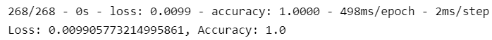

# Neural_Network_Charity_Analysis

### Overview of the analysis:

We will use our machine learning and neural networks to help Alphabet Soup company to predict what kinds of applicants would be successful if funded by Alphabet Soup.

### Results:

The data is shown here:

- #### Data Preprocessing

  - ##### the target of the model

    IS_SUCCESSFUL

  

  - ##### the features of the model

    APPLICATION_TYPE            

    AFFILIATION                  

    CLASSIFICATION              

    USE_CASE                     

    ORGANIZATION                 

    STATUS                       

    INCOME_AMT                   

    SPECIAL_CONSIDERATIONS       

    ASK_AMT                   

  

  - ##### variable(s) removed from the input data

​				EIN

​				NAME

​				

Processed Data

- #### Compiling, Training, and Evaluating the Model

  - How many neurons, layers, and activation functions did you select for your neural network model, and why?

    We used 2 hidden layers with 80 neurons and 30 neuron, respectively.  The activation function for first hidden layer is "Relu" and for the second hidden layer is "Sigmoid".

  

  ​		The reason for 80 neurons for first layer is that the encoded features are 44.  80 is about 2 times of 44.  It is to provide enough neurons to handle the features.  The second layer neurons number is to find a balance between 80 and the output result of 1.  So, 30 is a relatively reasonable number.

  

  

  

  - Were you able to achieve the target model performance?

    No.  The results are not satisfactory for the test data set.  The accuracy is only 0.52.

  

  

  - What steps did you take to try and increase model performance?

​			   We take several steps:

​						remove noisy features -  change APPLICATION_TYPE from 9 to 6;

​						add additional neurons - change second hidden layer neuron number from 30 to 80;

​						add additional hidden layers - add a third hidden layer with 80 neurons;

​						modify activation function - change the third hidden layer activation function to "sigmoid"

​				

​				The result is much improved with accuracy of 1.00 and loss of 0.01.

### **Summary:** 

The final optimized deep learning model consists of 3 hidden layers with 80 neurons in each layer.  The weight results are store every 5 epochs.  The final result is saved into file "optimized_trained_application.h5".  The accuracy is 1.00 and loss is 0.01.

We can also use EasyEnsembleClassifier to solve this problem.  The data is imbalanced.  So we can use ensemble and balanced resampling to classify whether the application successful or not.

